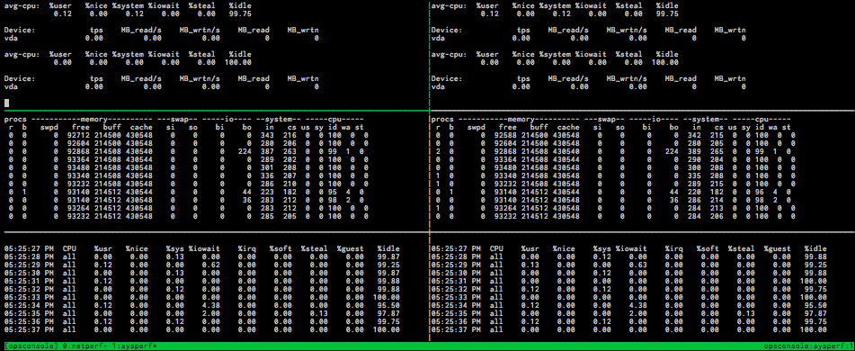
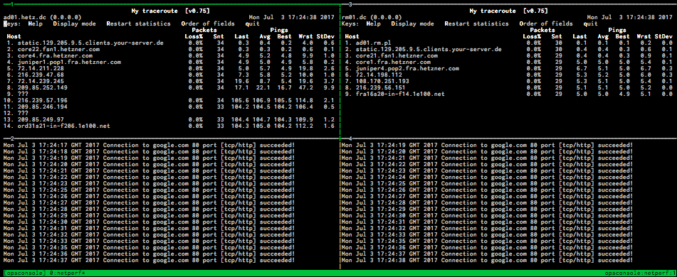

# opsconsole

## Installation

Add this line to your application's Gemfile:

```ruby
gem 'opsconsole'
```

And then execute:

    $ bundle

Or install it yourself as:

    $ gem install opsconsole

## Overview

Tool to simultaneously access and interact with multiple remote machines.

Tool to access and interact with multiple remote machines at once. Console can be detached and re-attached at will. Terminals presented within current window can be accessed simultaneously.

**NOTES**

Console consists of sessions, windows and panes:

* Remote terminals are presented in panes, e.g. single pane shows output of a command running on a remote host.

* Multiple panes are organised in windows, this way operator is able to observe multiple terminals on one screen, also may organize certain commands and hosts into groups (e.g. a window called 'sysperf' showing 'iostat' and 'vmstat' commands running on database servers, another window called 'netperf' showing 'curl' and 'ping' commands running on web servers.

* Multiple windows are organized in sessions, this way operator may further organize and separate panes based on custom criteria, say keep 'staging' and 'production' session.

Console organises hosts in columns, commands in rows. Terminals are displayed on a single screen hence considerable amount of screen real estate is required for the tool to be usable.

tmux controls the console and the terminals, console can be detached and later re-attached at will. Terminals presented within current window can be accessed simultaneously. Refer to tmux documentation in regards to its configuration, in particular useful key bindings.

Upon creation console connects to remote server(s) via SSH using operators credentials and executes specified command(s). SSH connects to remote servers as $USER, that is unless different username is requested via $SSH_USER or tool's --user option. Make sure SSH keys are in place.

Command may be anything that works with with:

    $ tmux new-window ssh host '<command>'

for example:

    $ opsconsole create ... -c 'htop'

    $ opsconsole create ... -c 'ping google.com'

    $ opsconsole create ... -c 'while true; do echo $(date) $(nc -zw 2 google.com 80); sleep 1; done'

## Usage

Situations when you may want to use it...

* Checking your servers vitals

```
$ opsconsole create -w sysperf --hosts={host1,host2} -c 'iostat -d -p vda 1' -c 'vmstat 1' -c 'mpstat 1'
```



* Checking whether your servers can connect to the outside world just fine

```
$ opsconsole create -w netperf --hosts={host1,host2} -c 'mtr google.com' -c 'while true; do echo $(date) $(nc -zvw 2 google.com 80); sleep 1; done'
```



## Development

After checking out the repo, run `bin/setup` to install dependencies. Then, run `rake spec` to run the tests. You can also run `bin/console` for an interactive prompt that will allow you to experiment.

To install this gem onto your local machine, run `bundle exec rake install`. To release a new version, update the version number in `version.rb`, and then run `bundle exec rake release`, which will create a git tag for the version, push git commits and tags, and push the `.gem` file to [rubygems.org](https://rubygems.org).

## Contributing

Bug reports and merge requests are welcome on GitLab at [gitlab.com/rafalmierzwiak/opsconsole](https://gitlab.com/rafalmierzwiak/opsconsole).

## License

The gem is available as open source under the terms of the [MIT License](http://opensource.org/licenses/MIT).
